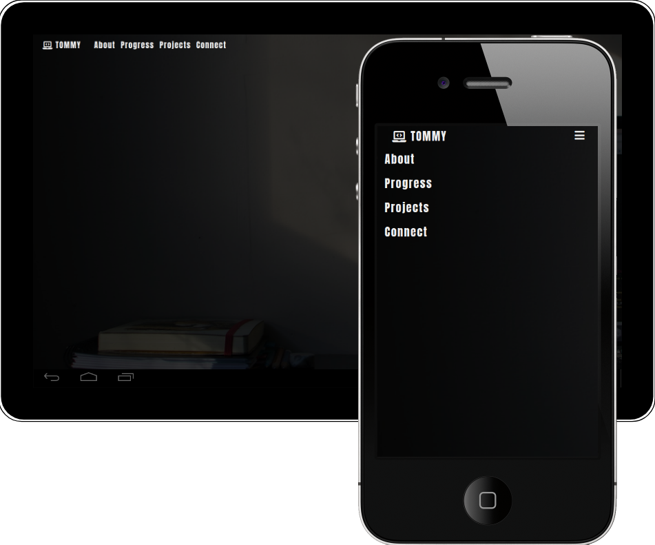

# My progress on becoming a web developer

 

The goal with this site to show my friends and family my progress in learning full stack web development. At first I planned to make a portfolio page but later decided against it because I think the portfolio will be more useful when I have more information to present and greater knowlage when it comes to for example javascript.

 

## UX

 

## User Stories

 

- Find information about the site owner.
- Find information about the site owners progress as a student at the code institute.
- Images of Hamburg and Gothenburg (where the site owner lives and where he is from).
- Contact the site owner.

 

### User Goals

 

As a user, I want

 

- a website with a transparent navbar and footer that is focused on beautiful images.
- to find information about the site owners progress on becoming a full stack web developer.
- there to be a contact form in case I want to recommend someone to collaborate with the site owner, or maybe even hire the site owner.
- to see graphs on each stage the site owner is taking to reach his goal to become a full stack web developer.

 

### Site Owner Goals

 

As a site owner, I want

 

- to showcase my progress as a student to my friends and family.
- to show the progress of each part of the course I am taking at the Code Institute.
- the site to be a channel to present my projects and progress.
- the site to be useful if my network wants to recommend people interested in collaboration to get in touch with me.

 
 

## User Requirements and Expectations

 

### Requirements

 

- Provide information about Tommy's progress as a student.
- Provide information about the projects.
- Provide a navbar to navigate the site.
- Provide visually appealing content with a focus on beautiful images.
- Provide a contact form in case someone want to recommend collaboration with or hiring the site owner.

 

### Expectations

 

- Navigation should be carefully thought out and easy to understand.
- The content should be formed around images in a beautiful way.
- Projects should be displayed in cards with links in a way that makes it easy for users to understand.

 

## Wireframe

 

 
 

## Features

 

- **Index** a short description of the site with a few pictures of Hamburg and Gothenburg to make it look nice.

- **About** This is a short about text in English, German and Swedish to make an introduction to people that might not know me. It will also have the country flags over each language.

- **Progress** Progress bars for each individual part of the course I am taking at the Code Institute

- **Projects** I am using this page to introduce some projects that I am interested in at the moment but when my own projects are completed I will add them here.

- **Connect** I have made this site in case some of my friends or family wants to recommend people to collaborate with me, or maybe hire me.

 

## Technologies Used

 

### Languages

 

- [HTML](https://en.wikipedia.org/wiki/HTML)

- [CSS](https://en.wikipedia.org/wiki/CSS)

 

### Tools & Libraries

 

- [Bootstrap](<https://en.wikipedia.org/wiki/Bootstrap_(front-end_framework)>)

- [Git](https://git-scm.com/)

- [Font-Awesome](https://fontawesome.com/)

- [Google fonts](https://fonts.google.com/)

- [Pencil](https://pencil.evolus.vn/)

 

## Testing

 

#### I first ran my css file trough a [CSS Validator](https://jigsaw.w3.org/css-validator/) without finding any errors.

 

#### I then ran my html files trough a [HTML Validator](https://validator.w3.org/) and I found a few errors that now is taken care of.

 

- The index page was missing a heading, something I resolved by changing a paragraph to a heading.

- The index page also had a spelling error in the carouselControls which is now corrected.

- There was also a spelling error in the navbar that I now have corrected. The error is from when I copied the text.

 

### Responsiveness

 

- I tested the responsiveness of every page throughout the process of building the site.

- I looked at my site in different sizes using google dev tools to see how the site would look and respond in each one.

- After advice from my mentor Reuben Ferrante I changed the layout of my project cards to make them look better in tablet view.

 

### Contact form

 

- I tested the contact form to make sure that the form validation worked as expected on each field by typing in data.

 

### Design

 

- My design choice of having a transparent footer and navbar presented a problem with the body content overlapping the footer. I solved this by adding a background colour to my footer after advise from my mentor.

 

## Deployment

 

### I created this site with vscode and with git I pushed it to github where I also published the site.

 

I made the following steps in deploying my site:

- Pushed my commits from git to github.

- Logged in to my github account.

- Selected my repositories.

- Navigated to milestone-project1.

- Clicked on settings.

- Scrolled down to where I can do the github pages settings.

- Selected the master branch from the dropdown menu.

- Clicked on save.

 

## Credits

 

### Media

 

Most of the images at my website comes from Unsplash (source of freely usable images). I would like to give credit to the people who created these images:

 

#### Background images

 

- [Emile Perron](https://unsplash.com/photos/xrVDYZRGdw4)

- [Thom Holmes](https://unsplash.com/photos/RbR3kf9M4F8)

- [Isaac Smith](https://unsplash.com/photos/6EnTPvPPL6I)

- [Andrew Neel](https://unsplash.com/photos/cckf4TsHAuw)

- [Chen Mizrach](https://unsplash.com/photos/1NTOQHBRegA)

 

#### Index pictures of Gothenburg and Hamburg

 

- [Miguel Ángel Sanz](https://unsplash.com/photos/6f5cTP2T28U)

- [Edvin Johansson](https://unsplash.com/photos/Mmjkm_ueuDM)

- [Jonas Jacobsson](https://unsplash.com/photos/20qv9cTILhU)

- [Meduana](https://unsplash.com/photos/PdnseHuDFZU)

- [Jonas Tebbe](https://unsplash.com/photos/j22K61_1peg)

- [Sid Saxena](https://unsplash.com/photos/NCVQKpU1xH4)

 

### Content

 

All the content for my projects page comes from the Wikipedia site or the website for each project

 

- [Vue.js wikipedia](https://en.wikipedia.org/wiki/Vue.js)
- [LineageOS wikipedia](https://en.wikipedia.org/wiki/LineageOS)
- [OpenAI wikipedia](https://en.wikipedia.org/wiki/OpenAI)
- [PatrOwl website](https://www.patrowl.io/)

 

## Acknowledgements

 

I would like to thank my mentor Reuben Ferrante for his valuable advice and
support throughout this project. I would also like to thank the teachers at the Code Institute for their guidance through different projects which has been an inspiration when I created this web site.
